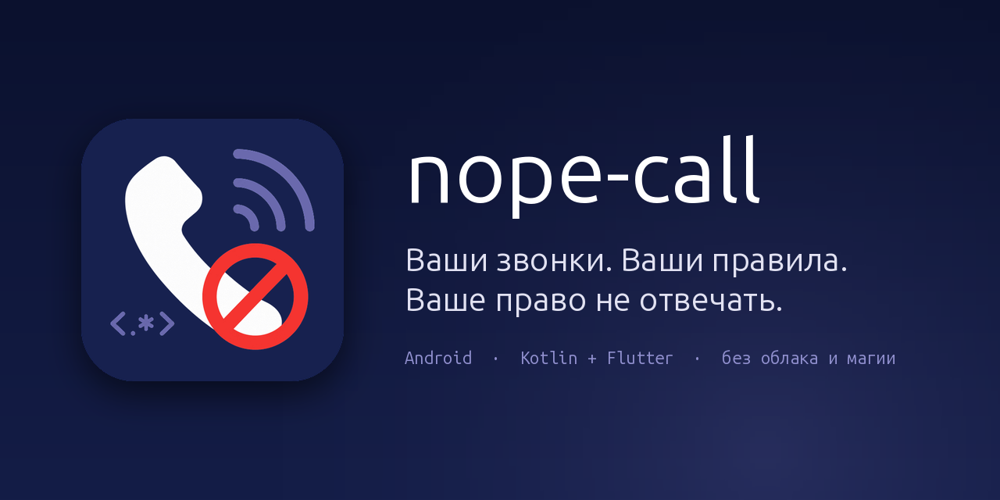

# nope-call

Блокировка входящих звонков по правилам — Android 10 и новее, задел под iOS.
Раздаётся APK напрямую, без Google Play.

## Что делает

Правила по номеру: точное совпадение, начало, окончание, содержит, регулярное выражение.
Все записи одного номера сводятся к одному виду, поэтому правило «начинается с `8495`» ловит
звонок, пришедший как `+74951234567`, и наоборот.

Правила по операторской подписи звонящего (41-ФЗ): по всей подписи, отдельно по наименованию
организации и отдельно по категории вызова. Русский шаблон ловит подпись в транслите —
«реклама» совпадает с `Reklama`, — и учитывает разные схемы транслитерации: у одной организации
подпись приходила и как `Poleznyy`, и как `Polezniy`.

Журнал двух слоёв: собственные проверки приложения и копия системного журнала вызовов Android.
Из записи журнала правило создаётся в один тап — с показом того, сколько записей под него попадёт.

Режим наблюдения записывает, что реально присылает оператор, и показывает сводку прямо
в приложении: доля звонков с подписью, доля подписей, пришедших уже после решения, задержки
решения. Отсюда же выгрузка логов за выбранный период одной кнопкой.

## Принцип

**Блокируем только при уверенности.** Звонок отклоняется, только если сработало явное правило
пользователя. Если правило не совпало, название звонящего недоступно, снимок правил повреждён
или истёк бюджет проверки — звонок проходит, а причина записывается в журнал.

Никаких эвристик, скорингов и «похоже на спам» — во всей кодовой базе. Пропущенный спам стоит
раздражения; заблокированный звонок от врача, банка или школы стоит несопоставимо дороже,
а приложение, которое угадывает, невозможно отладить.

## Приватность

Всё хранится на устройстве и никуда не отправляется само.

* **Проверка звонка не обращается к сети.** У модуля, который принимает решение, нет сетевых
  зависимостей, и это проверяется задачей сборки, а не обещанием в документации.
* **Сеть используется единственным образом** — проверить и скачать обновление приложения.
  Поэтому в списке разрешений есть `INTERNET` и `REQUEST_INSTALL_PACKAGES`. Модуль обновления
  не имеет доступа ни к правилам, ни к журналу, ни к логам: у него нет зависимости на них,
  и это тоже проверяется сборкой.
* **Резервное копирование выключено.** Журнал звонков и логи не уезжают в облако и не переносятся
  на новое устройство: `allowBackup="false"` плюс правила извлечения данных.
* **Режим наблюдения включён по умолчанию и это осознанный компромисс.** Он пишет номер
  и название каждого входящего звонка, чтобы на вопрос «почему не сработало» можно было ответить
  по факту, а не по пересказу. Записи ротируются по сроку и объёму, режим выключается одним
  переключателем, накопленное удаляется отдельной кнопкой. Состав данных раскрывается
  при первом запуске.
* **Выгрузка логов по умолчанию обезличена**: номера маскируются, имя из телефонной книги
  скрывается, операторская подпись организации остаётся — она и есть предмет разбора.
  Куда отправить архив, выбирает пользователь; приложение само его никуда не отправляет.
* Аналитики, крешлитики, рекламы и сторонних SDK нет.

Необязательные разрешения и что будет без них: **журнал звонков** — не будет исхода звонка,
длительности и исходящих; **контакты** — не будет работать правило «есть в контактах», и широкие
правила не будут отличать знакомые номера; **уведомления** — не будет сообщений о заблокированном
звонке и о потере роли. Блокировка по номеру работает без всех трёх.

## Установка

1. Скачать APK со страницы релизов и установить, разрешив установку из этого источника.
2. Назначить приложение средством проверки звонков — Android разрешает это только одному
   приложению одновременно.
3. Создать первое правило. Пока правил нет, все звонки проходят: приложение не угадывает,
   кого блокировать.

Блокировка по названию звонящего — best effort: оператор передаёт подпись не в каждом звонке,
это зависит от сети, поддержки VoLTE и договора звонящего с оператором. Правила по номеру
надёжнее. Экран «Диагностика» показывает, приходит ли подпись на этом устройстве вообще.

* [Иконки](branding/README.md) — комплекты для APK, iOS и репозитория
